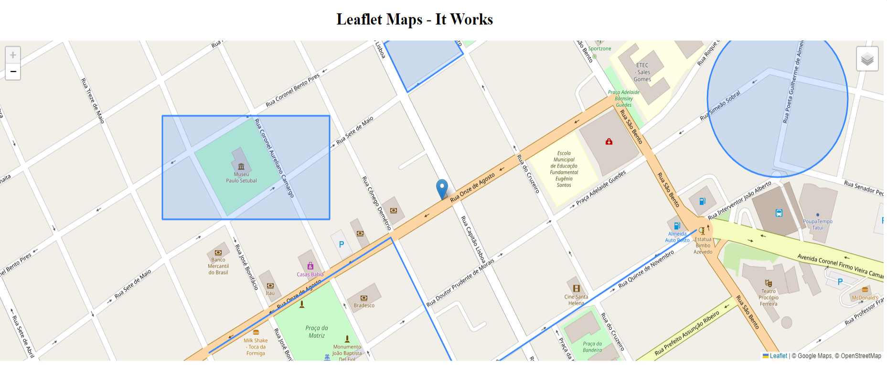

# React Native Leaflet

[](https://badge.fury.io/js/react-native-leaflet)
[](https://opensource.org/licenses/MIT)

A powerful React component to integrate Leaflet maps with complete support for markers, polygons, polylines, circles, and rectangles. Developed following the same philosophy and approach of the [laravel-leaflet](https://github.com/ginocampra/laravel-leaflet) project.



## Features

- 🗺️ Complete Leaflet integration
- 📍 Support for Markers
- 🔷 Support for Polygons
- 📏 Support for Polylines
- ⭕ Support for Circles
- ▭ Support for Rectangles
- 🎯 Complete TypeScript with well-defined types
- ⚙️ Highly configurable and extensible
- 📦 Ready for npm publication
- 🔧 Custom hooks for map control

## Installation

```bash
npm install react-native-leaflet leaflet
```

or with yarn:

```bash
yarn add react-native-leaflet leaflet
```

## Basic Usage

```jsx
import React from 'react';
import { LeafletMap } from 'react-native-leaflet';

function App() {
  const mapOptions = {
    center: {
      lat: -23.347509,
      lng: -47.847536
    },
    zoom: 18,
    height: '600px',
    width: '100%'
  };

  const markers = [
    {
      position: {
        lat: -23.347509,
        lng: -47.847536
      },
      title: 'My Marker',
      popupContent: 'This is an example marker'
    }
  ];

  return (
    <LeafletMap
      title="My Map"
      options={mapOptions}
      initialMarkers={markers}
    />
  );
}

export default App;
```

## Advanced Examples

### With Polygons, Polylines and Circles

```jsx
import React from 'react';
import { LeafletMap } from 'react-native-leaflet';

function AdvancedMap() {
  const mapOptions = {
    center: {
      lat: -23.347509,
      lng: -47.847536
    },
    zoom: 18,
    zoomControl: true,
    minZoom: 13,
    maxZoom: 18,
    height: '600px',
    draggable: true,
    googleview: true
  };

  const markers = [
    {
      position: {
        lat: -23.347509,
        lng: -47.847536
      },
      draggable: false,
      title: 'Tatuí - SP'
    }
  ];

  const polygons = [
    {
      positions: [
        { lat: -23.34606, lng: -47.84818 },
        { lat: -23.34575, lng: -47.84759 },
        { lat: -23.34615, lng: -47.84729 },
        { lat: -23.34651, lng: -47.84792 }
      ],
      color: '#3388ff',
      fillColor: '#3388ff',
      fillOpacity: 0.2
    }
  ];

  const polylines = [
    {
      positions: [
        { lat: -23.348914, lng: -47.850147 },
        { lat: -23.347850, lng: -47.848109 },
        { lat: -23.349209, lng: -47.847293 },
        { lat: -23.347781, lng: -47.844675 }
      ],
      color: '#ff0000',
      weight: 3
    }
  ];

  const circles = [
    {
      position: {
        lat: -23.346569,
        lng: -47.843763
      },
      radius: 80,
      color: '#00ff00',
      fillOpacity: 0.3
    }
  ];

  return (
    <LeafletMap
      title="Advanced Map"
      options={mapOptions}
      initialMarkers={markers}
      initialPolygons={polygons}
      initialPolylines={polylines}
      initialCircles={circles}
      onMarkerClick={(marker, index) => console.log('Marker clicked:', marker)}
      onPolygonClick={(polygon, index) => console.log('Polygon clicked:', polygon)}
    />
  );
}

export default AdvancedMap;
```

### With Programmatic Control

```jsx
import React, { useRef } from 'react';
import { LeafletMap } from 'react-native-leaflet';

function MapWithControls() {
  const mapRef = useRef();

  const handleFitBounds = () => {
    mapRef.current?.fitBounds();
  };

  const handleSetCenter = () => {
    mapRef.current?.setCenter({
      lat: -23.5505,
      lng: -46.6333
    }, 15);
  };

  const mapOptions = {
    center: {
      lat: -23.347509,
      lng: -47.847536
    },
    zoom: 18
  };

  return (
    <div>
      <button onClick={handleFitBounds}>Fit Bounds</button>
      <button onClick={handleSetCenter}>Go to São Paulo</button>
      <LeafletMap
        ref={mapRef}
        options={mapOptions}
      />
    </div>
  );
}

export default MapWithControls;
```

## Component Props

### LeafletMap

| Prop | Type | Required | Description |
|------|------|----------|------------|
| `options` | `MapOptions` | Yes | Map configuration options |
| `title` | `string` | No | Map title |
| `initialMarkers` | `Marker[]` | No | Array of initial markers |
| `initialPolygons` | `Polygon[]` | No | Array of initial polygons |
| `initialPolylines` | `Polyline[]` | No | Array of initial polylines |
| `initialCircles` | `Circle[]` | No | Array of initial circles |
| `initialRectangles` | `Rectangle[]` | No | Array of initial rectangles |
| `onMapReady` | `(map: L.Map) => void` | No | Callback when map is ready |
| `onMarkerClick` | `(marker: Marker, index: number) => void` | No | Callback when marker is clicked |
| `onPolygonClick` | `(polygon: Polygon, index: number) => void` | No | Callback when polygon is clicked |
| `onPolylineClick` | `(polyline: Polyline, index: number) => void` | No | Callback when polyline is clicked |
| `onCircleClick` | `(circle: Circle, index: number) => void` | No | Callback when circle is clicked |
| `onRectangleClick` | `(rectangle: Rectangle, index: number) => void` | No | Callback when rectangle is clicked |
| `className` | `string` | No | Custom CSS class |
| `containerStyle` | `React.CSSProperties` | No | Custom container styles |

### MapOptions

```typescript
interface MapOptions {
  center: Position;              // Initial map position
  zoom: number;                  // Initial zoom level
  zoomControl?: boolean;         // Show zoom controls (default: true)
  minZoom?: number;              // Minimum zoom
  maxZoom?: number;              // Maximum zoom
  width?: string;                // Map width (default: "100%")
  height?: string;               // Map height (default: "600px")
  draggable?: boolean;           // Allow dragging map (default: true)
  touchZoom?: boolean;           // Touch zoom (default: true)
  scrollWheelZoom?: boolean;     // Zoom with mouse wheel (default: true)
  doubleClickZoom?: boolean;     // Zoom with double click (default: true)
  boxZoom?: boolean;             // Box zoom (default: true)
  keyboard?: boolean;            // Keyboard controls (default: true)
  googleview?: boolean;          // Add Google Street View (default: false)
}
```

### Marker

```typescript
interface Marker {
  position: Position;
  title?: string;
  draggable?: boolean;
  icon?: string;
  popupContent?: string;
  onClick?: () => void;
}
```

## Ref Methods

You can access the following methods through the component ref:

```typescript
const mapRef = useRef();

// Add marker programmatically
mapRef.current.addMarker(marker);

// Remove marker by index
mapRef.current.removeMarker(0);

// Fit zoom to show all elements
mapRef.current.fitBounds();

// Get map center
const center = mapRef.current.getCenter();

// Set new center
mapRef.current.setCenter({ lat: -23.5505, lng: -46.6333 }, 15);

// Get Leaflet instance
const map = mapRef.current.map;
```

## Utility Functions

```typescript
import { 
  calculateDistance, 
  getCenterPoint, 
  formatPosition, 
  isPositionInBounds 
} from 'react-native-leaflet';

// Calculate distance between two points (in meters)
const distance = calculateDistance(pos1, pos2);

// Get center point of multiple positions
const center = getCenterPoint(positions);

// Format position for display
const formatted = formatPosition(position, 6);

// Check if position is within bounds
const inBounds = isPositionInBounds(position, [minLat, minLng, maxLat, maxLng]);
```

## Project Structure

```
react-native-leaflet/
├── src/
│   ├── LeafletMap.tsx       # Main component
│   ├── types.ts             # Type definitions
│   ├── hooks.ts             # Custom hooks
│   ├── utils.ts             # Utility functions
│   └── index.ts             # Main exports
├── dist/                    # Compiled build
├── package.json
├── tsconfig.json
├── rollup.config.js
├── README.md
└── LICENSE.md
```

## Available Scripts

```bash
# Build the project
npm run build

# Development with watch
npm run dev

# Run tests
npm run test

# Lint code
npm run lint

# Prepare for publication
npm run prepublishOnly
```
## Compatibility

- React 16.8+
- Leaflet 1.7.0+
- Node.js 14+

## License

MIT License © 2025 - See [LICENSE.md](LICENSE.md) for details.

## Contributing

Contributions are welcome! Please:

1. Fork the project
2. Create a branch for your feature (`git checkout -b feature/AmazingFeature`)
3. Commit your changes (`git commit -m 'Add some AmazingFeature'`)
4. Push to the branch (`git push origin feature/AmazingFeature`)
5. Open a Pull Request

## Support

To report issues or suggest improvements, [open an issue](https://github.com/your-username/react-native-leaflet/issues).

## Inspiration

This project was developed following the same philosophy and approach of the excellent [laravel-leaflet](https://github.com/ginocampra/laravel-leaflet) project by [@ginocampra](https://github.com/ginocampra), adapting its concepts for the React ecosystem.
